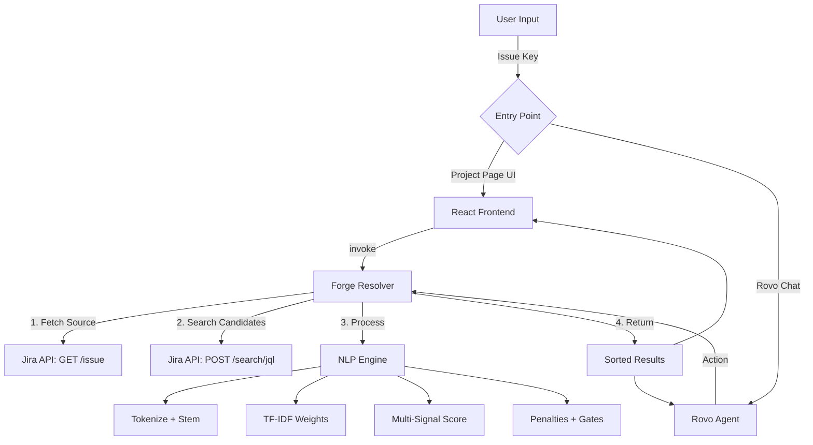

# Rovo Issue Deduplicator - Technical Documentation

A production-style Atlassian Forge app for deterministic, explainable duplicate Jira issue detection. Built for Codegeist hackathon.

---

## 1. Executive Summary

### Core Problem
Duplicate issues waste developer time, pollute backlogs, and fragment discussion. Traditional approaches rely on external ML services or LLM embeddings, which:
- Violate data residency requirements
- Introduce non-deterministic scoring
- Add latency and external dependencies
- Cannot explain *why* something is a duplicate

### Solution
A fully self-contained, Forge-native duplicate detection engine that:
- Runs **entirely within the Atlassian security boundary** (no external API calls)
- Uses **deterministic, explainable IR techniques** (TF-IDF, Jaccard, Porter Stemmer)
- Provides **multi-signal scoring** with transparent reasoning
- Integrates with **Rovo Agent** for conversational interaction

---

## 2. System Architecture

### Technology Stack

| Layer | Technology |
|-------|------------|
| Platform | Atlassian Forge (Node.js 22.x, ARM64, 256MB) |
| Frontend | React 18 + Vite (Custom UI) |
| Backend | Forge Resolvers (@forge/api, @forge/resolver) |
| AI Integration | Rovo Agent + Actions |
| Data | Jira REST API v3 (read/write scopes) |

### Module Structure

```
rovo-issue-deduplicator/
├── manifest.yml          # Forge app definition
├── src/
│   └── index.js          # Core NLP engine + resolvers (673 lines)
└── static/
    └── src/
        ├── App.jsx       # React UI (405 lines)
        └── index.css     # Styling
```

### Data Flow



---

## 3. User Interaction Model

### Entry Points

| Surface | Integration | User Action |
|---------|-------------|-------------|
| **Project Page** | jira:projectPage module | Enter issue key -> Click "Find Duplicates" |
| **Rovo Chat** | rovo:agent with Actions | Natural language: "Find duplicates for PROJ-123" |

### Workflow

1. User provides an issue key (e.g., PROJ-123)
2. System fetches the source issue from Jira
3. System queries for candidate issues in the same project
4. NLP engine scores each candidate against the source
5. Results displayed with:
   - Similarity percentage (0-100)
   - Confidence tier (High/Possible/Low)
   - Contributing signals (keywords, reporter, labels, etc.)
6. User can **Link as Duplicate** -> Creates Jira link + transitions to Done

### Link as Duplicate Action

The linkAsDuplicate function:
1. Creates a Jira issue link of type "Duplicate"
2. Fetches available transitions for the duplicate issue
3. Transitions to Done status if available

---

## 4. Algorithmic Approach

### 4.1 Text Preprocessing Pipeline

All text undergoes a rigorous normalization pipeline before scoring:

```
Raw Text -> Lowercase -> Remove Special Characters -> Tokenize -> 
Filter Short Words -> Canonize -> Stem -> Remove Stopwords
```

#### Step-by-Step Breakdown

| Step | Implementation | Purpose |
|------|----------------|---------|
| **Lowercase** | .toLowerCase() | Case-insensitive matching |
| **Character Filter** | /[^a-z0-9s]/g -> space | Remove punctuation |
| **Tokenization** | .split(/s+/) | Word boundary detection |
| **Length Filter** | word.length > 2 | Remove noise tokens |
| **Canonization** | Synonym map | Map domain variants (signin->login, latency->performance) |
| **Stemming** | Porter Stemmer | Reduce morphological variants |
| **Stopword Removal** | 100+ word Set | Remove common non-informative words |

#### Stopwords Set

Contains 100+ words including:
- Articles: a, an, the
- Prepositions: in, on, at, to, for
- Common verbs: is, are, was, have, do
- Domain noise: issue, bug, error, problem, page, button

The inclusion of domain-specific stopwords (issue, bug, error) is intentional: these words appear in nearly every issue and carry no discriminative power.

---

### 4.2 Porter Stemmer Implementation

The porterStemmer function implements the classic Porter stemming algorithm.

#### Why Porter Stemmer?

| Criterion | Porter Stemmer | Lemmatization | LLM Embeddings |
|-----------|---------------|---------------|----------------|
| **Determinism** | Yes Always same output | Yes | No Temperature-dependent |
| **No External API** | Yes Pure JavaScript | Requires dictionary | Requires API call |
| **Explainability** | Yes Rule-based | Yes | No Black box |
| **Performance** | Yes O(n) per word | Slower | High latency |

#### Implementation Highlights

```javascript
// Regex patterns are hoisted to module scope for V8 optimization
const RE_SS_IES = /(ss|i)es$/;
const RE_EED = /eed$/;
const RE_ED_ING = /(ed|ing)$/;
// ... 15+ pre-compiled patterns

function porterStemmer(w) {
  if (w.length < 3) return w;  // Short words unchanged
  // Step 1a: sses->ss, ies->i, s->epsilon
  // Step 1b: eed->ee, ed/ing->epsilon (with repairs)
  // Step 2: ational->ate, izer->ize, etc.
  // Step 3: icate->ic, ful->epsilon, etc.
  // Step 4: al/ance/er->epsilon (if measure > 1)
  // Step 5a: Remove trailing e
  // Step 5b: ll->l
}
```

#### Canonization Layer

Before stemming, a synonym map normalizes domain-specific variants:

```javascript
const CANON = {
  signin: 'login', auth: 'login', sign: 'login',
  fail: 'failure', fails: 'failure', failed: 'failure',
  latency: 'performance', lag: 'performance', slow: 'performance',
  bug: 'failure', glitch: 'failure', crash: 'failure',
  screen: 'ui', view: 'ui', modal: 'ui'
};
```

This ensures "Authentication fails" and "Login failure" share the canonical form login failure.

---

### 4.3 Similarity Techniques

#### Summary Scoring: TF-IDF with Bigrams

The scoreSummary function combines three techniques:

**1. Weighted Keyword Matching (TF-IDF-style)**

```javascript
function getTokenWeight(token, frequencies, totalDocs) {
  const count = frequencies[token] || 0;
  if (totalDocs < 2) return 1.0;
  const idf = 1.0 + Math.log(totalDocs / (count + 1));
  return Math.max(0.01, Math.min(1.0, idf));  // Clamped [0.01, 1.0]
}
```

- Rare tokens receive higher IDF scores (more discriminative)
- Common tokens down-weighted
- Clamping prevents extreme values

**2. Bigram Phrase Matching**

```javascript
function getBigrams(tokens) {
  const bigrams = [];
  for (let i = 0; i < tokens.length - 1; i++) {
    bigrams.push(`${tokens[i]} ${tokens[i + 1]}`);
  }
  return bigrams;
}
```

Shared bigrams receive a 2.5x multiplier, rewarding phrase preservation:
- "login failure" matched as a phrase scores higher than separate "login" + "failure"

**3. Containment Boost**

```javascript
if (sRaw.includes(cRaw) || cRaw.includes(sRaw)) {
  containmentBoost = CONTAINMENT_BOOST;  // +5 points
}
```

Rewards substring matches for short, obvious duplicates.

#### Description Scoring: Jaccard Similarity with Shingles

The getShingles function generates 3-gram token shingles:

```javascript
function getShingles(tokens, k = 3) {
  const shingles = new Set();
  for (let i = 0; i <= tokens.length - k; i++) {
    shingles.add(tokens.slice(i, i + k).join(' '));
  }
  return shingles;
}
```

Jaccard index calculation:
```javascript
const union = new Set([...shinglesA, ...shinglesB]).size;
const intersection = [...shinglesA].filter(x => shinglesB.has(x)).length;
const descScore = (intersection / union) * 15;  // Max 15 points
```

**Why Shingles?**
- Robust against word reordering
- Captures local context
- More sensitive to paraphrasing than bag-of-words

---

### 4.4 Metadata Signals

| Signal | Weight | Logic | Rationale |
|--------|--------|-------|-----------|
| **Reporter Match** | 20% | Binary (same accountId) | Users frequently double-post |
| **Label Overlap** | 20% | |A intersection B| / |A union B| | Shared categorization |
| **Recency** | 10% | Exponential decay: e^(-days/30) x 10 | Issues close in time often describe same incident |
| **Status Weight** | Multiplier | Done: 0.95, In Progress: 0.9, Other: 1.0 | Prioritize resolved issues |

#### Recency Scoring Formula

```javascript
if (days < RECENCY_WINDOW) {  // 90 days
  recencyScore = Math.round(Math.exp(-days / 30) * 10 * 100) / 100;
}
```

| Days Apart | Recency Score |
|------------|--------------|
| 0 | 10.0 |
| 7 | 7.88 |
| 30 | 3.68 |
| 60 | 1.35 |
| 90 | 0.50 |

---

### 4.5 Penalties, Caps, and Intent-Based Gating

#### Penalty System

| Condition | Penalty | Rationale |
|-----------|---------|-----------|
| Issue Type Mismatch | -15 | Bug vs Story unlikely duplicates |
| Component Mismatch | -10 | Frontend vs Backend issues |
| Action Verb Mismatch | -10 | "Crash" vs "Slow" are different problems |

#### Intent Extraction

```javascript
const ACTION_VERBS = new Set([
  'fail', 'crash', 'error', 'timeout', 'slow', 'stuck', 'broken'
]);
const OBJECT_TERMS = new Set([
  'login', 'api', 'upload', 'dashboard', 'payment', 'search'
]);
```

Intent fingerprint = (Action Verbs x Object Terms)

#### Score Capping

```javascript
function applyScoreCapping(currentScore, components, intentCtx) {
  // Single-signal cap: max 65 (keyword) or 60 (other)
  if (activeSignals === 1) {
    if (keywordScore > 0) finalScore = Math.min(finalScore, 65);
    else finalScore = Math.min(finalScore, 60);
  }
  // Intent gate: >70 requires 2+ signals AND shared object
  finalScore = applyIntentGate(finalScore, activeSignals, sharedObject, 70);
  return Math.min(100, Math.max(0, Math.round(finalScore)));
}
```

#### Intent Gate Logic

```javascript
function applyIntentGate(score, activeSignals, sharedObject, gateThreshold = 70) {
  if (score >= gateThreshold) {
    if (activeSignals < 2 || !sharedObject) {
      return gateThreshold - 1;  // Cap at 69
    }
  }
  return score;
}
```

**Purpose**: A high-confidence score (>=70) requires corroboration from multiple signals AND a shared semantic object (e.g., both issues mention "login").

---

## 5. Scoring Design Analysis

### Signal Weight Distribution

| Signal | Raw Weight | Cap |
|--------|------------|-----|
| Summary (TF-IDF + Bigrams) | 40 | 40 |
| Description (Shingles) | 15 | 15 |
| Reporter | 20 | 20 |
| Labels | 20 | 20 |
| Recency | 10 | 10 |
| **Gross Total** | **105** | --- |

### Why No Single Signal Dominates

1. **Summary capped at 40**: Even perfect summary match cannot exceed 40/100
2. **Reporter alone reaches 20**: Insufficient for "Possible Match" (50) threshold
3. **Labels alone hit 20**: Same limitation
4. **Single-signal cap**: Any score with only one active dimension is hard-capped at 60-65

### False Positive Control Mechanisms

| Mechanism | Effect |
|-----------|--------|
| MIN_SCORE = 50 | Results below 50% filtered |
| Single-signal cap (60-65) | Prevents inflated scores from one signal |
| Intent Gate (70) | High confidence requires evidence diversity |
| Penalty system | Structural mismatches reduce score |
| Stopword removal | Filters non-discriminative terms |

### Balanced Scoring Rationale

The design ensures:
- **Two strong signals** typically required for >=50 score
- **Three+ signals** required for >=70 score
- Penalties can push high-scoring candidates below threshold
- No single metadata field can classify a duplicate alone

---

## 6. Engineering & Design Qualities

### 6.1 Performance Optimizations

| Optimization | Implementation | Impact |
|--------------|----------------|--------|
| **Regex Hoisting** | All Porter Stemmer patterns compiled at module load | Avoids per-call compilation |
| **Token Caching** | LRU cache with 1000-entry limit | Avoid re-stemming common words |
| **Frequency Caching** | Project-level cache with 5-minute TTL | Avoid recalculating IDF for same corpus |
| **Set Pre-computation** | Labels, components, bigrams converted to Set on preprocessing | O(1) intersection lookups |
| **Early Exit** | Skip candidates below MIN_SCORE before full scoring | Reduces computation |

#### Cache Implementation

```javascript
const tokenCache = new Map();  // word -> stemmed
const freqCache = new Map();   // projectKey -> {frequencies, ts}

// LRU eviction
if (tokenCache.size >= CACHE_LIMIT) 
  tokenCache.delete(tokenCache.keys().next().value);
```

### 6.2 Explainability

Every result includes human-readable reasons[]:

```javascript
const reasons = [];
if (sharedKeywords.length > 0) reasons.push(`Shared keywords: ${sharedKeywords.slice(0, 3).join(', ')}`);
if (bigramScore > 0) reasons.push('Phrase match detected');
if (reporterScore > 0) reasons.push('Same reporter');
if (labelShared.length > 0) reasons.push('Shared labels');
if (sharedObject) reasons.push('Shared intent object');
```

Debug mode (DEBUG_DEDUP=1) outputs full signal breakdown:
```json
{"k":"PROJ-456","summary":"32.5","desc":"8.2","reporter":20,"labels":0,"recency":6.1,"pen":0,"final":67}
```

### 6.3 Determinism

Given identical inputs:
- Same tokenization (fixed regex)
- Same stemming (pure function)
- Same weights (no randomness)
- Same output (reproducible scores)

**No sources of non-determinism**:
- No random sampling
- No temperature parameters
- No external API variability

### 6.4 Forge Constraint Suitability

| Forge Constraint | Solution |
|------------------|----------|
| No external network (egress blocked) | All NLP runs locally |
| 256MB memory limit | Streaming processing, capped caches |
| 10-second timeout | Early exits, efficient algorithms |
| No native modules | Pure JavaScript implementation |
| Security sandbox | Uses only @forge/api for Jira access |

---

## 7. Trade-offs & Limitations

### 7.1 Why LLM/Embeddings Were Not Used

| Factor | LLM/Embedding Approach | This Approach |
|--------|------------------------|---------------|
| **Data Egress** | Requires external API -> compliance risk | Zero egress |
| **Determinism** | Temperature-dependent outputs | Fully deterministic |
| **Explainability** | Black-box similarity | Signal-by-signal breakdown |
| **Latency** | 200-500ms per API call | <100ms in-memory |
| **Cost** | Per-token pricing | Zero marginal cost |
| **Forge Compliance** | Would require egress permission | Fully sandboxed |

### 7.2 Known Limitations

| Limitation | Impact | Mitigation |
|------------|--------|------------|
| **No semantic understanding** | "Cannot access dashboard" != "Dashboard unreachable" without synonym coverage | Canonization map covers common cases |
| **English-only** | Stopwords and stemmer are English | Would need multilingual extension |
| **Fixed synonym map** | New domain terms require code change | Could externalize to configuration |
| **No cross-project matching** | Only searches within same project | Intentional for data isolation |
| **100-candidate limit** | Very large projects may miss older duplicates | JQL ordered by creation date |

### 7.3 Future Improvements

1. **Configurable weights**: Allow per-project tuning via Forge storage
2. **Multi-language support**: Pluggable stemmers for other languages
3. **Learning from links**: Analyze historical duplicate links to tune weights
4. **Cross-project mode**: Optional flag to search related projects
5. **Batch analysis**: Periodic scan of all open issues for duplicate clusters
6. **Confidence calibration**: Compare against human-labeled ground truth

---

## 8. API Reference

### findDuplicates(payload)

**Input**:
```json
{ "issueIdOrKey": "PROJ-123" }
```

**Output**:
```json
{
  "success": true,
  "message": "Found 3 potential duplicates.",
  "duplicates": [
    {
      "issueKey": "PROJ-100",
      "summary": "Login button not responding",
      "score": 78,
      "reasons": ["Shared keywords: login, button", "Same reporter"],
      "status": "Done",
      "projectKey": "PROJ"
    }
  ]
}
```

### linkAsDuplicate(payload)

**Input**:
```json
{
  "duplicateIssueKey": "PROJ-456",
  "primaryIssueKey": "PROJ-123"
}
```

**Output**:
```json
{
  "success": true,
  "message": "Linked PROJ-456 as duplicate and transitioned to Done."
}
```

---

## 9. Conclusion

The Rovo Issue Deduplicator demonstrates that high-quality duplicate detection is achievable without external ML services. By combining classic IR techniques (TF-IDF, Porter Stemmer, Jaccard similarity) with domain-aware heuristics (intent gating, penalty system, multi-signal capping), the solution achieves:

- **Precision**: Multi-gate scoring prevents false positives
- **Explainability**: Every score is decomposable into contributing signals
- **Performance**: Sub-100ms response times within Forge constraints
- **Privacy**: Zero data egress, fully sandboxed execution
- **Reliability**: Deterministic, reproducible results

This approach is suitable for any environment where compliance, explainability, and predictability are valued over marginal accuracy gains from opaque ML models.

---

*Built for Codegeist 2025 . Atlassian Forge Platform*
